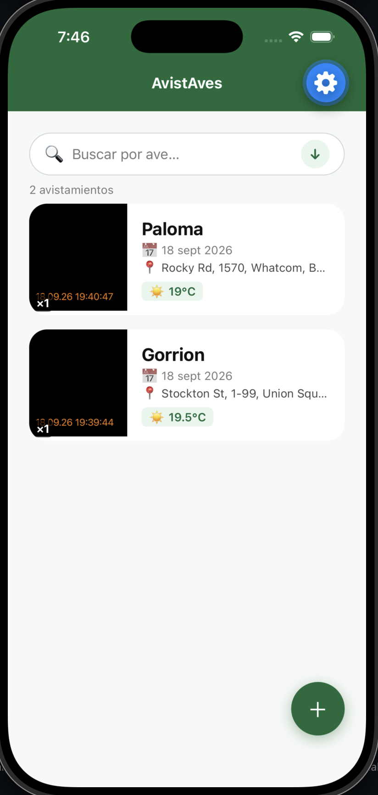
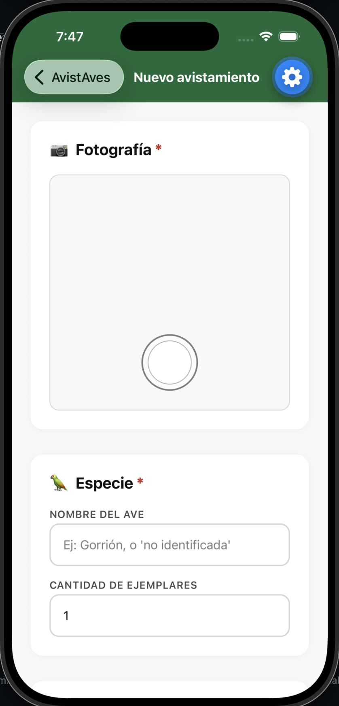
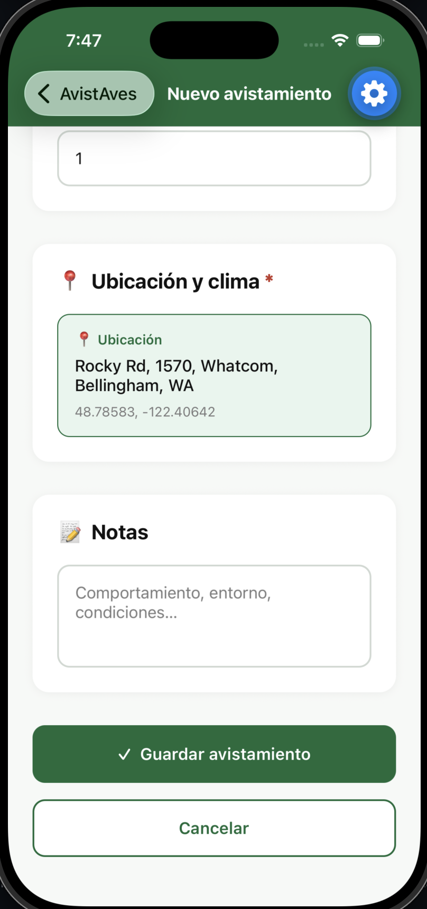
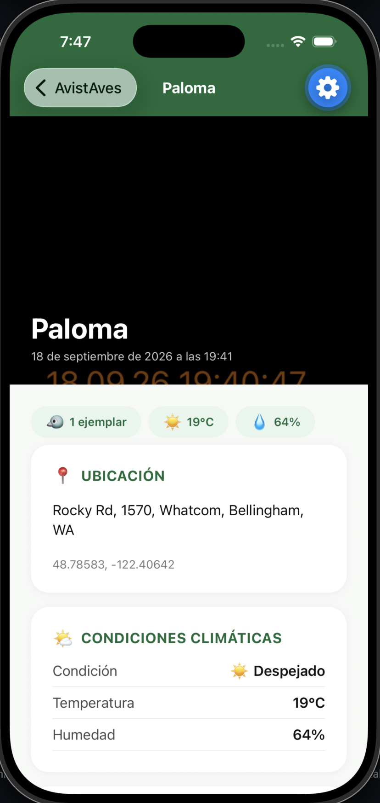
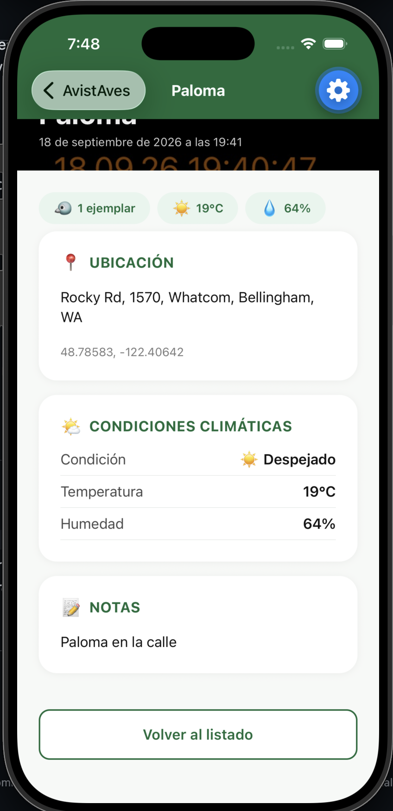
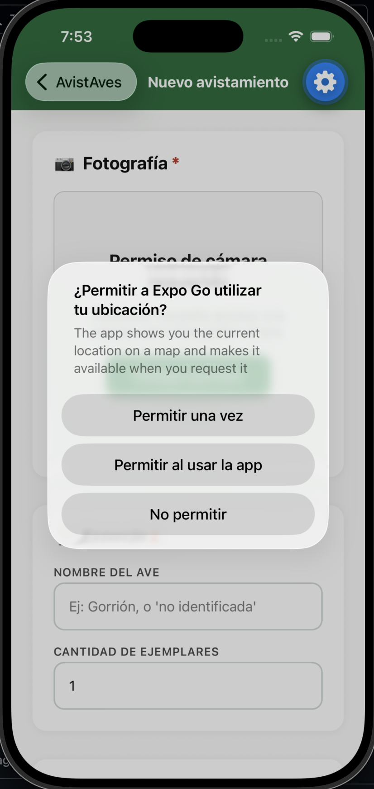
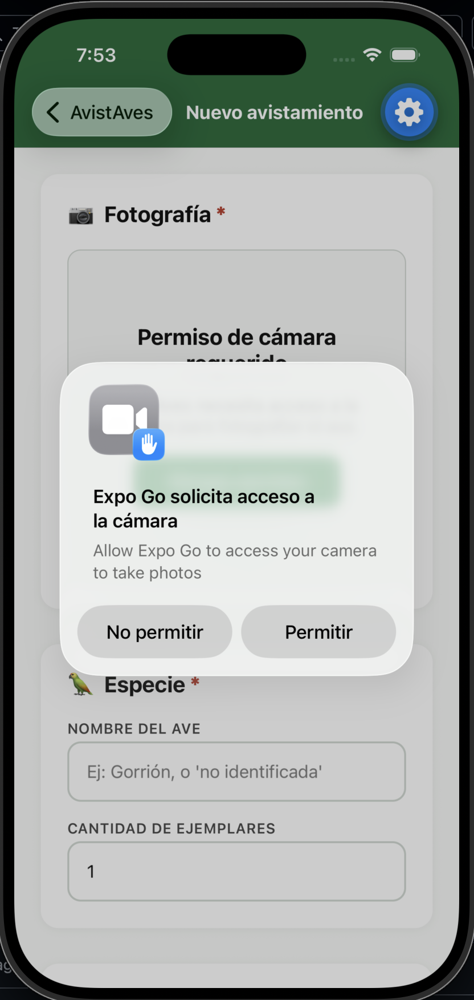
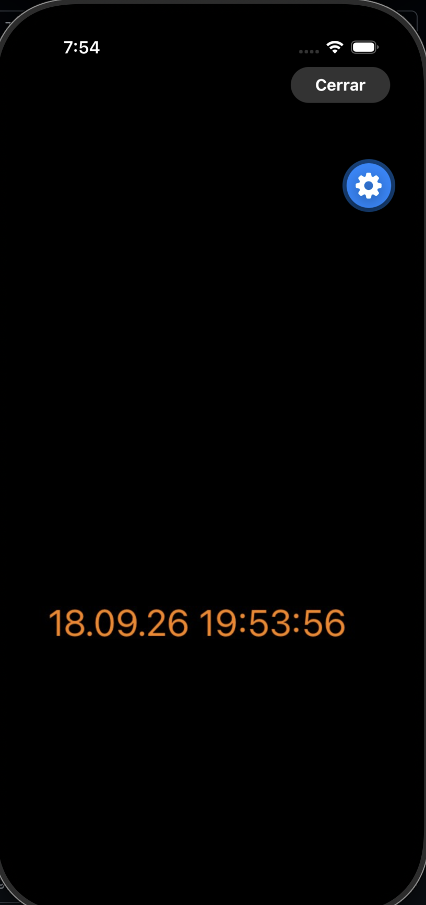

# AvistAves

Aplicación móvil desarrollada con React Native + Expo para registrar avistamientos de aves en terreno. Creada como proyecto de evaluación.

## Características

- **Registro rápido**: Captura fotografías directamente desde la app.
- **Geolocalización Automática**: Integración con GPS y geocodificación inversa (convierte lat/lng a dirección legible).
- **Clima en tiempo real**: Obtiene automáticamente temperatura y condiciones meteorológicas vía Open-Meteo API (tolerante a fallos).
- **Modo offline local**: Guarda datos persistenemente con `AsyncStorage` asegurando su disponibilidad incluso sin conexión a la red.
- **Listado y Filtros**: Búsqueda por especie y ordenamiento por fecha.
- **Interfaz optimizada para terreno**: Botones grandes, contrastes altos, y fácil lectura para uso a una mano.

## Galería de Pantallas

A continuación se presenta un flujo básico de la aplicación:

|                                       Listado Principal                                       |                                          Formulario de Registro                                           |
| :-------------------------------------------------------------------------------------------: | :-------------------------------------------------------------------------------------------------------: |
|    _Estado inicial de la aplicación._ |    _Formulario de captura con cámara y permisos._ |

|                                           Opciones de Registro                                           |                                           Listado Lleno                                            |
| :------------------------------------------------------------------------------------------------------: | :------------------------------------------------------------------------------------------------: |
|    _Datos de especie, clima automático y notas._ |    _Visualización de las aves capturadas._ |

|                                   Detalle de Avistamiento                                   |                                          Búsqueda y Filtrado                                          |
| :-----------------------------------------------------------------------------------------: | :---------------------------------------------------------------------------------------------------: |
|    _Datos expandidos y Hero image._ |    _Barra de búsqueda para filtrar la lista._ |

|                                        Ordenamiento Dinámico                                         |                                            Pantalla Completa                                             |
| :--------------------------------------------------------------------------------------------------: | :------------------------------------------------------------------------------------------------------: |
|    _Cambio de orden ascendente/descendente._ |    _Modal inmersivo para ver la foto en grande._ |

## Instalación y Uso

1. Clonar este repositorio.
2. Ejecutar `npm install` para instalar dependencias.
3. Iniciar el servidor local de Expo con `npm start` (o `npx expo start`).
4. Utilizar la app Expo Go en un dispositivo físico iOS/Android, o en un simulador.
   _Nota: Dado que la aplicación requiere cámara funcional, es preferible utilizar un dispositivo real._
